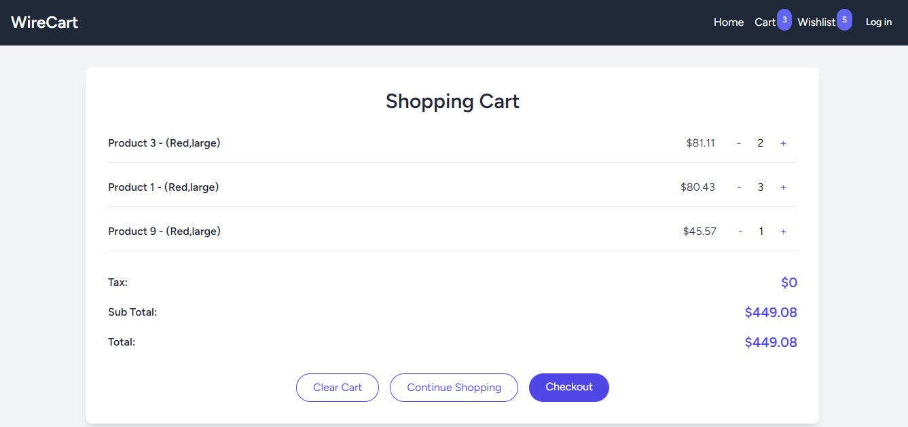
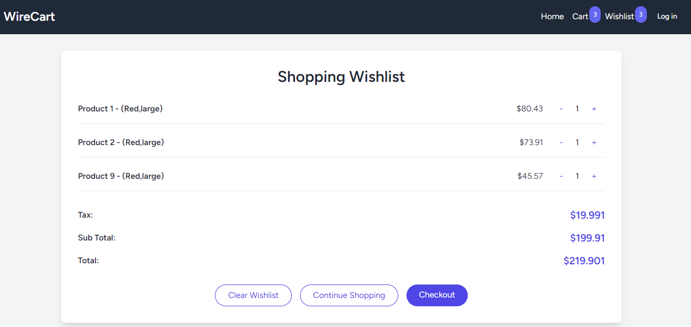

# WireCart - A Demo Application

## Introducing WireCart: A Livewire-powered Shopping Experience with the Cart Package

WireCart is a dynamic and intuitive single-page application that seamlessly integrates the powerful Cart package with your Laravel-powered e-commerce website. This demo app brings together the functionalities of a shopping cart and a wishlist, providing users with a smooth and interactive shopping experience.

## Features at a Glance

- **Shopping Cart and Wishlist**: WireCart incorporates two essential components - a shopping cart and a wishlist. Users can easily add, remove, and manage items in both instances, providing a comprehensive shopping experience.

- **Seamless Cart Management**: The integration of the Cart package allows for efficient cart management. Add, remove, and manipulate items with ease, offering users a hassle-free shopping experience.

- **Effortless Interactivity**: With Livewire, WireCart ensures that every interaction is lightning-fast and responsive. Add items to your cart or wishlist without having to reload the page.

- **Dynamic Instance Creation**: WireCart leverages the `instance()` method from the Cart package to dynamically create instances for both the shopping cart and wishlist, enhancing the flexibility of the application.

## Screenshots

## Getting Started with WireCart

Ready to experience WireCart, powered by the Cart package, for yourself? Follow these simple steps to set up the demo application on your local machine:

1. [Clone the WireCart Repository](get-started.md#step-1-clone-the-repository)
2. [Install Dependencies](get-started.md#step-2-install-dependencies)
3. [Set Up Environment Variables](get-started.md#step-3-set-up-environment-variables)
4. [Generate Application Key](get-started.md#step-4-generate-application-key)
5. [Migrate the Database](get-started.md#step-5-migrate-the-database)
6. [Start the Application](get-started.md#step-7-start-the-application)
7. [Access the Application](get-started.md#step-8-access-the-application)
8. [Explore and Test](get-started.md#step-9-explore-and-test)

[Get Started with WireCart](get-started.md)

Discover the power of WireCart and the Cart package, and revolutionize your e-commerce platform with an interactive shopping experience that sets you apart from the competition.
