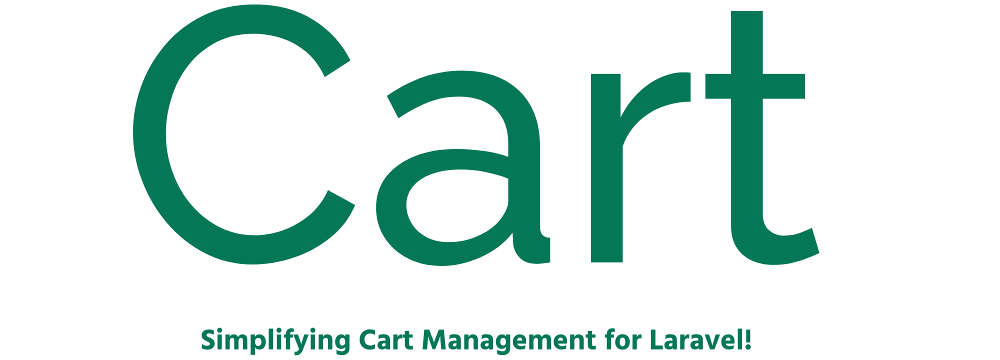

Welcome to the Cart documentation, your definitive guide to Simplifying Shopping Cart Management for Laravel. Cart offers Streamlined Cart Operations for Laravel-powered E-commerce.

## Introduction

In the world of online retail, effective cart management is crucial. That's where Cart comes in. Cart have fine-tuned the process, providing you with a comprehensive solution for all things cart-related. Whether it's adding products, or calculating totals, Cart ensures a seamless experience.

## Features

- **Flexible Configuration**: Customize your cart instances with specific tax rates and other configurations to suit your business needs.

- **Multiple Instances**: Define and manage multiple cart instances, allowing for different configurations for various use cases.

- **Tax Calculation**: Enable or disable tax calculations for each cart instance, providing flexibility in tax handling.

- **Intuitive API**: A straightforward API makes it easy to interact with your cart, enabling smooth integration into your Laravel application.

- **Flexible Tax Rate Options**: Each cart instance can operate with its own distinct tax rate. This level of flexibility ensures dynamic tax handling tailored to specific use cases.

- **Coupon Integration**: Enhance your cart’s functionality with coupon support. Define and manage coupon codes that can be applied to your cart, allowing for discounts and special offers. Configure coupon rules, expiration dates, and usage limits to meet your promotional needs.

## Getting Started

Ready to empower your online store? Dive into the straightforward installation process outlined in the [Installation](/guide/installation.md) section.

- [Installation Guide](/guide/installation.md)
- [Usage Instructions](/usage/usage.md)
- [Demo App](/demo/demo.md)

## Support My Work ☕

If you find Cart helpful and would like to support my work, you can buy me a coffee. Your support will help keep this project alive and thriving. It's a small token of appreciation that goes a long way.

## License 🔐

**Cart** is open-sourced software licensed under the MIT License (MIT). Please see [License File](LICENSE.md) for more information.

Let's embark on a journey towards a more efficient and delightful shopping experience with Cart!

 

 <b>Made with ❤️ from Pakistan</b> 

